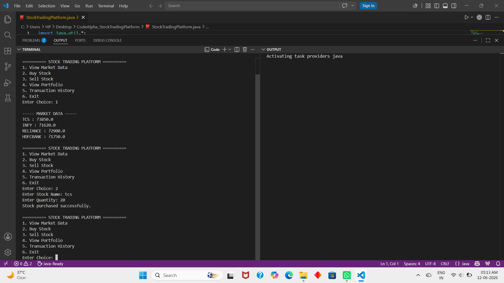

# CodeAlpha_StockTradingPlatform
Java-based stock trading platform that simulates buying and selling stocks, portfolio management, and transaction tracking. 
# Description
A Java-based Stock Trading Platform that allows users to buy and sell stocks, manage their portfolio, and track transaction history. This project demonstrates the use of Object-Oriented Programming concepts and Java collections.
# Features
1.View available market stocks
2.Buy stocks
3.Sell stocks
4.View portfolio
5.Track transaction history
6.Manage account balance
# Technologies Used
1.Java
2.OOP Concepts
3.ArrayList
4.HashMap
5.VS Code
# How to Run
1.Open the project in VS Code.
2.Compile the program:
# Bash
javac StockTradingPlatform.java
Run the program:
# Bash
java StockTradingPlatform
# Screenshots
1.Main Menu
.png)
2.Result Window

Internship
This project was developed as part of the CodeAlpha Java Programming Internship. :::
